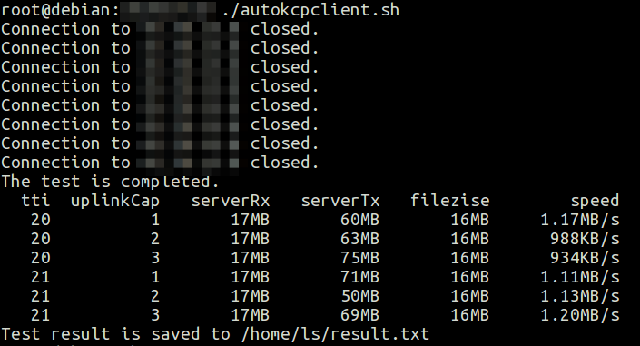

# v2ray-test
本项目的脚本可以自动修改 V2Ray KCP 配置（仅 tti 和 uplinkCap）并进行测速，以选出更好的配置参数，省去手动测试的烦琐。

脚本在 Debian 8 测试通过，使用前请阅读以下说明：
- V2Ray 两端须配置好 mKCP 能够正常使用 mKCP 代理
- 脚本需要自动修改服务器配置、获取服务器网卡流量信息、重启 V2Ray 等，因此
  - 脚本使用无口令的 SSH 密钥登录，如对安全有顾虑请修改脚本使用带口令密钥或其它方式登录
  - 密钥长度、网络状况、机器性能等因素会影响登录 ssh 的时间，即会占用一定的测试时间
  - 为正常操作服务器，脚本默认使用root用户登录服务器，未测试非root用户情况下脚本是否正常运行
  - 基于上一条，默认 autokcpserver.sh 的目录为 root 的 home 目录，所以请将 autokcpserver.sh 放到该目录下
- 脚本使用 proxychains 和 wget 通过服务器代理下载进行测试，因此需安装配置好 proxychains
- shell 脚本不支持浮点运算，并且此脚本的单位换算使用1000来计算，如 238623595Bytes = 238623595/1000000MB = 238MB，会带来误差。但下载速度采用 wget 给出的结果。
- 使用脚本前请修改脚本当中的服务器地址、端口、网卡名称、要测试的 tti 及 uplinkCap 的范围，网卡名称请在 autokcpserver.sh 修改
- 脚本默认服务器采用的初始化系统是 systemd，默认服务端 V2Ray 配置文件路径为 /etc/v2ray/config.json
- V2Ray 服务端的配置文件 kcpSttings 中的 tti 及 uplinkCapacity 必须有，脚本只能对这两项的数值进行修改而不会自动添加。为不影响测试结果，请将 V2Ray 两端配置的 downlinkCapacity 设为一个较大的值
- 脚本默认下载www.dvlnx.com的大小约为 16MB 的 denemo-2.0.8.tar.gz 进行测试
- 脚本默认会在当前目录产生一些临时下载文件和数据文件，请确保当前用户对当前目录有读写权限。在测试完成之后脚本自动删除除最终的测试结果之外的临时文件（服务器上的结果文件不会删除）
- 脚本默认仅对每一组 V2Ray 配置参数进行一次测试，理论上不符合统计学的要求，结果仅供参考
- 由于暂时没有解决 SSH 命令的输出重定向问题，使用此脚本会输出 "Connection to 1.2.3.4 closed." 这样的语句（1.2.3.4 是实际的服务器地址），显示多少跟要测多少组数据有关

由于以上因素，使用此脚本前请配置好自己的机器。对脚本不满意或有特定需要者请自行修改脚本。

使用说明:

1. 配置好你的 V2Ray
2. 如果你的 PC 没有 proxychains ，请安装并配置好代理
3. 生成配置好 SSH 密钥
4. 将 autokcpserver.sh 下载至要测试服务器， autokcpclient.sh 下载至PC（Linux）
5. 修改好相关参数，运行 autokcpclient.sh

测试结果中，serverRx 为服务下载文件所花的流量，serverTx 服务器发送给客户端花费的流量。

测试结果示例：

